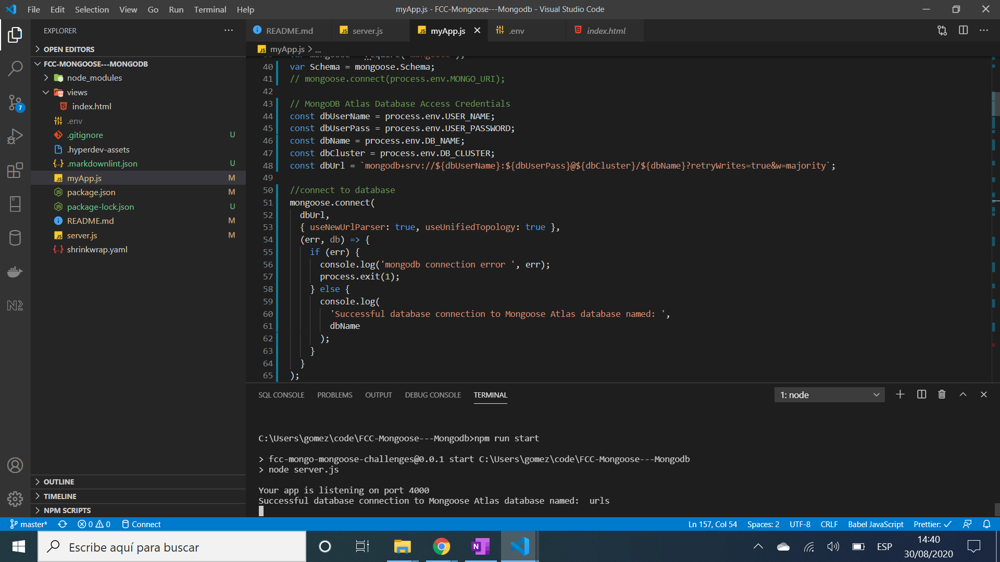

# :zap: FCC Mongo & Mongoose Challenges

* 12 Exercises to learn mongoDB and Mongoose, part of FreeCodeCamp Front End Certification.

**\* Note: to open web links in a new window use: _ctrl+click on link_**

## :page_facing_up: Table of contents

* [:zap: FCC Mongo & Mongoose Challenges](#zap-fcc-mongo--mongoose-challenges)
	* [:page_facing_up: Table of contents](#page_facing_up-table-of-contents)
	* [:books: General info](#books-general-info)
	* [:camera: Screenshots](#camera-screenshots)
	* [:signal_strength: Technologies](#signal_strength-technologies)
	* [:floppy_disk: Setup](#floppy_disk-setup)
	* [:computer: Code Examples](#computer-code-examples)
	* [:cool: Features](#cool-features)
	* [:clipboard: Status & To-Do List](#clipboard-status--to-do-list)
	* [:clap: Inspiration](#clap-inspiration)
	* [:envelope: Contact](#envelope-contact)

## :books: General info

* [mongoose findOne](https://mongoosejs.com/docs/api.html#model_Model.findOne) used to check if username exists in database before adding new user object
* [How to Use findOneAndUpdate() in Mongoose](https://mongoosejs.com/docs/tutorials/findoneandupdate.html) used to find the first document that matches a given filter, updates then returns the document

## :camera: Screenshots

.

## :signal_strength: Technologies

* [Node v12](https://nodejs.org/en/) javaScript runtime built on Chrome's V8 JavaScript engine
* [Express v5](https://expressjs.com/) Fast, unopinionated, minimalist web framework for Node.js
* [MongoDB Atlas](https://www.mongodb.com/cloud/atlas) cloud-based NoSQL database
* [mongoose v5](https://mongoosejs.com/) object modelling for node.js.
* [body-parser v1](https://www.npmjs.com/package/body-parser) to parse incoming request bodies in middleware before handlers
* [Cors v2](https://www.npmjs.com/package/cors) node.js package for providing Connect/Express middleware that can be used to enable CORS with various options.

## :floppy_disk: Setup

* Create MongoDB Atlas Cloud database (or local installed MongoDB database) and add user access/database credentials (USER_NAME, USER_PASSWORD, DB_CLUSTER, PORT, DB_NAME & SESSION_SECRET) to a new `.env` file. These are used in `myApp.js`.
* Add your IP address to MongoDB Atlas Network Access whitelist. Or simply whitelist all (IP address 0.0.0.0/0).
* Run `npm run start` or `node server.js` for a dev server.
* Navigate to `http://localhost:4000/` (or other port selected/default port 3000) for home screen.
* This is just a list of 12 exercises with their solutions - navigating to localhost does not actually do anything
* The app will not automatically reload if you change any of the source files.

## :computer: Code Examples

* extract from `myApp.js` to find a person by their automatically generated database id

```javascript
const findPersonById = function (personId, done) {
	Person.findById({ _id: personId }, (err, data) => {
		if (err) return done(err);
		done(null, data);
	});
};
```

## :cool: Features

* MongoDB Atlas Cloud database is easy to setup and use

## :clipboard: Status & To-Do List

* Status: Working
* To-Do: optionally: replace var with const/let and use fat arrow functions.

## :clap: Inspiration

* [freeCodeCamp: Introduction to the MongoDB and Mongoose Challenges](https://www.freecodecamp.org/learn/apis-and-microservices/mongodb-and-mongoose/)

## :envelope: Contact

* Repo created by [ABateman](https://www.andrewbateman.org) - you are welcome to [send me a message](https://andrewbateman.org/contact)
